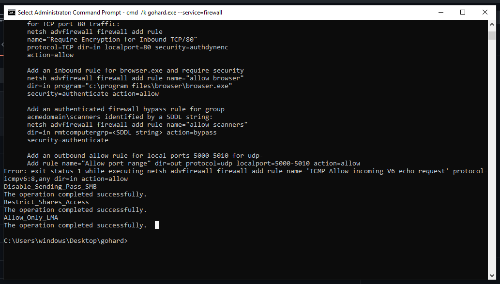

# gohard

gohard (golang harden) is a partial rewrite of [grapheneX](https://github.com/grapheneX/grapheneX), which I also try to actively maintain.
The goal was to get rid of all third party libs (not successful), and only have a CLI app.

I started learning Golang recently, so I thought this would be a good practice.

### Build

64-bit linux
```commandline
GOOS=linux GOARCH=amd64 go build -o bin/
```

64-bit windows
```commandline
set GOOS=windows GOARCH=amd64
go build
```

Unfortunately Microsoft Defender might flag this binary as a potential virus and refuse to execute it, so disabling the
Real-time protection is a must-do in order to run.

### Usage

Help message:
```commandline
(linux) bin/gohard -h
```

Use SSH hardening modules:
```commandline
(linux) sudo -E bin/gohard --service=ssh
```

Use Kernel hardening modules
```commandline
(linux) sudo -E bin/gohard --service=kernel
```

Use firewall hardening modules
```commandline
(windows) cmd /k gohard.exe --service=firewall
```

And basically the same way for all the other services.

You can use 'ranges' to execute more than 1 module at the same time:


If you enter either wrong start / end index, gohard will exit:


You can also execute all available modules using '-':


If any command doesn't finish successfully gohard will throw out an error, but will continue with the execution of all
remaining modules:



### Contributing

This is my first golang project, so it might not have the best practices, that's why contributions are very welcome!

### License

[GPL](LICENSE)
