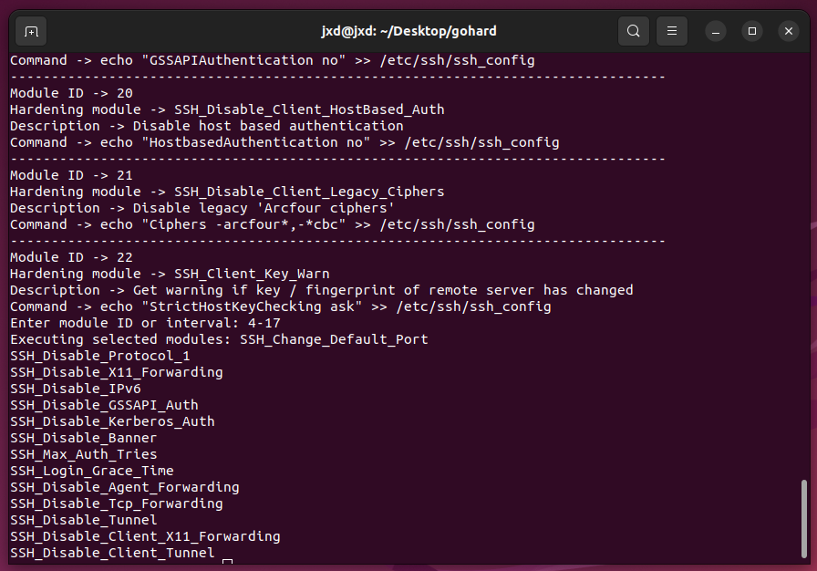
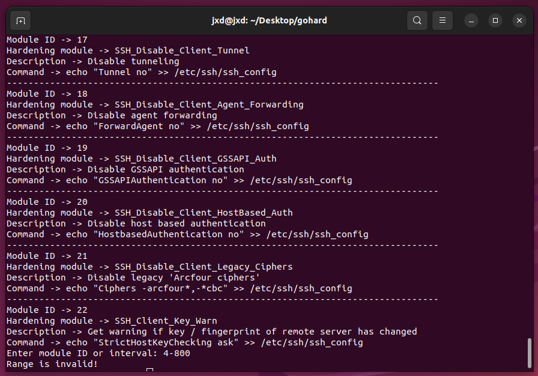
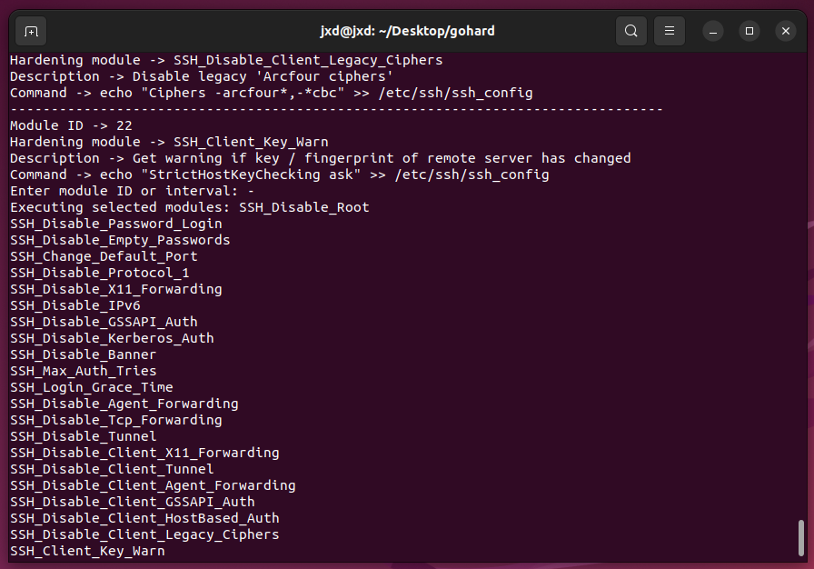

# gohard

gohard (golang harden) is a partial rewrite of [grapheneX](https://github.com/grapheneX/grapheneX), which I also try to actively maintain.
The goal was to get rid of all third party libs, and only have a CLI app.

I started learning Golang recently, so I thought this would be a good practice.

### Build

64-bit linux
```commandline
GOOS=linux GOARCH=amd64 go build -o bin/
```

64-bit windows
```commandline
set GOOS=windows GOARCH=amd64
go build
```

### Usage

Help message:
```commandline
(linux) bin/main -h
```

Use SSH hardening modules:
```commandline
(linux) sudo -E bin/main --service=ssh
```

Use Kernel hardening modules
```commandline
(linux) sudo -E bin/main --service=kernel
```

Use firewall hardening modules
```commandline
(windows) cmd /k main.exe --service=firewall
```

And basically the same way for all the other services.

You can use 'ranges' to execute more than 1 module at the same time:



If you enter either wrong start / end index, gohard will exit:



You can also execute all available modules using '-':



### Contributing

This was my first attempt at writing a project in Golang. The code may have some bad practices I might no be aware of yet.
Any contributions are welcome!

### License

[GPL](LICENSE)
